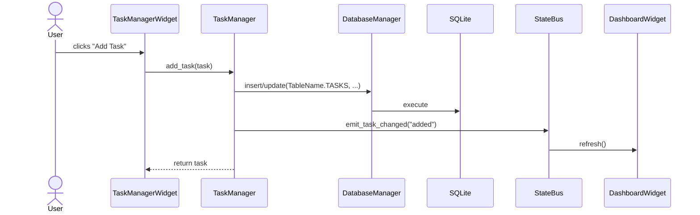
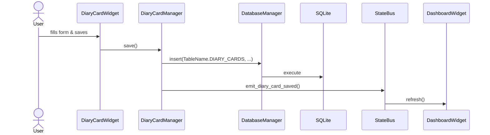

# Architecture

**Purpose:** System architecture, data flow, and design decisions.  
**Intended audience:** Engineers, architects, auditors.  
**Confidence:** Confirmed from source code. Inferences are labeled.  
**Source references:** `src/main.py`, `src/gui/main_window.py`, `src/core/database.py`, `src/core/wellness_orchestrator.py`, `src/gui/state_bus.py`  
**Last updated:** 2026-05-29

## Overall Architecture

Hearth follows a **layered desktop-application pattern** with reactive cross-widget communication.

```
┌─────────────────────────────────────────────────────────────┐
│                      Presentation Layer                      │
│  ┌──────────────┐ ┌──────────────┐ ┌──────────────────────┐ │
│  │  MainWindow  │ │   Widgets    │ │  Themes / StateBus   │ │
│  │(orchestrator)│ │(feature UI)  │ │ (reactive theming)   │ │
│  └──────┬───────┘ └──────┬───────┘ └──────────┬───────────┘ │
│         └─────────────────┴────────────────────┘             │
└─────────────────────────────────────────────────────────────┘
                              │
┌─────────────────────────────────────────────────────────────┐
│                    Domain / Service Layer                    │
│  ┌──────────┐ ┌──────────┐ ┌──────────┐ ┌────────────────┐ │
│  │ TaskMgr  │ │ MoodMgr  │ │ DiaryCard│ │ WellnessOrch   │ │
│  │ (SQLite) │ │ (SQLite) │ │ (SQLite) │ │ (cross-module) │ │
│  └────┬─────┘ └────┬─────┘ └────┬─────┘ └───────┬────────┘ │
│       └─────────────┴────────────┴────────────────┘          │
└─────────────────────────────────────────────────────────────┘
                              │
┌─────────────────────────────────────────────────────────────┐
│                      Data Layer                              │
│  ┌──────────────┐          ┌─────────────────────────────┐  │
│  │   SQLite     │          │          JSON files         │  │
│  │ (WAL mode)   │          │  settings, templates, keys  │  │
│  └──────────────┘          └─────────────────────────────┘  │
└─────────────────────────────────────────────────────────────┘
```

## Layers

### Presentation Layer (`src/gui/`)
- **PyQt6 widgets** render the UI.
- **`AdaptiveMainWindow`** is the central orchestrator. It owns references to all managers, lazy-loads optional subsystems, and wires widgets to themes/shortcuts.
- **`StateBus`** provides reactive pub/sub using PyQt6 signals/slots, decoupling widgets from managers.
- **`ThemeManager`** generates dynamic stylesheets and supports accessibility modes (color-blind, high-contrast, reduced motion, dyslexia font).

### Domain / Service Layer (`src/core/`, `src/wellness/`, `src/profiles/`)
- **Managers** encapsulate business logic and persistence.
- **`WellnessOrchestrator`** reads aggregated DB state to produce `WellnessSnapshot` and `CrisisSignal` objects.
- **`SubscriptionManager`** gates features by tier without network calls.
- **`TaskManager`** persists task records to SQLite and keeps templates/custom category labels in JSON.

### Data Layer (`src/core/database.py`)
- **`DatabaseManager`** provides thread-local SQLite connections, CRUD helpers, schema versioning, and migrations.
- **Schema version** is tracked in the `schema_version` table (currently v3).
- **JSON files** are used for settings, templates, custom category labels, license state, and some legacy wellness resources.

## Request / Interaction Lifecycle

### Example: Add a Task



### Example: Save a Diary Card



## State Management

- **Local state:** Each manager owns its in-memory cache and loads from persistence on instantiation.
- **Reactive state:** `StateBus` (PyQt6 signals/slots) decouples widgets from managers.
- **No global mutable state** except the `StateBus` singleton, initialized by `AdaptiveMainWindow`.

## Sync vs Async Behavior

- **All core operations are synchronous.** The app is a single-threaded PyQt6 desktop app.
- **Background timers** in `AdaptiveMainWindow`:
  - System stats update every 60s (`QTimer`)
  - Notification check every 5min (`QTimer`)
  - Update check 2s after UI init (`QTimer.singleShot`)
- **No threading** in business logic except `DatabaseManager`'s thread-local connections for safety.

## Business Logic Placement

| Concern | Location |
|---------|----------|
| Task CRUD, scheduling, NLP | `src/core/task_manager.py` |
| Mood entry bridge | `src/core/mood_manager.py` |
| Diary card CRUD | `src/core/diary_card_manager.py` |
| Crisis detection, daily briefing | `src/core/wellness_orchestrator.py` |
| Notification generation | `src/core/notification_engine.py` |
| Feature gating | `src/core/subscription_manager.py` |
| Profile logic | `src/profiles/` |
| Therapeutic exercises | `src/wellness/` |

## Major Dependencies and Integrations

| Dependency | Role | Runtime Critical? | Graceful Degradation? |
|------------|------|-------------------|----------------------|
| PyQt6 | GUI framework | **Yes** | No — app cannot start |
| SQLite (stdlib) | Persistence | **Yes** | No — core feature |
| numpy | Numerical ops | **Yes** | No — used in wellness orchestrator |
| cryptography | Encryption | No (optional) | Yes — secure folders disabled |
| psutil | System stats | No (optional) | Yes — stats show "unavailable" |
| scikit-learn | ML ranking | No | Yes — falls back to heuristic |
| sentence-transformers | NLP embeddings | No | Yes — smart file system degrades |
| hdbscan | File clustering | No | Yes — smart file system degrades |
| Chart.js (CDN) | Report charts | No | Yes — reports render without charts |

## Important Coupling Points

1. **`AdaptiveMainWindow` → all managers** — The main window instantiates or lazy-loads every manager. This is a known god-object pattern that centralizes wiring but creates a large dependency surface.
2. **Core event emission** — `TaskManager` emits through `core.state_bus`, so persistence and UI refresh behavior are coupled by process-global state.

## Known Architectural Weaknesses

1. **Inconsistent import style** — Some modules use `from core.X`, tests use `from src.core.X`. Both work because `src/` is added to `sys.path` at boot, but this is technical debt.
2. **God object main window** — `AdaptiveMainWindow` knows about ~20 managers. Extraction into a dedicated application controller would improve testability.
3. **Residual JSON config** — Task templates, custom category labels, settings, and license state still live outside SQLite.
4. **No schema migration framework** — Migrations are hardcoded in `database.py` `_MIGRATIONS` dict. Alembic or a similar tool would scale better.
5. **Lazy loading by string import** — Managers are imported inside `try/except` blocks in properties. This makes static analysis difficult and hides dependency errors until runtime.
