# Data Model

**Purpose:** Document entities, tables, relationships, and schema evolution.  
**Intended audience:** Backend engineers, DBAs, auditors.  
**Confidence:** Confirmed from `src/core/database.py` and migration code.  
**Last updated:** 2026-05-29

## Overview

Hearth uses **SQLite** (WAL mode, foreign keys enabled) as the primary persistence layer. `TaskManager` now stores task records in SQLite; JSON files remain for lightweight local settings, task templates, custom categories, and legacy import sources.

## Schema Version

Current version: **3**

Version history:
- v1 — Initial schema (implicit, created by `executescript`)
- v2 — Added `diary_cards` table (migration defined in `src/core/database.py` `_MIGRATIONS`)
- v3 — Expanded `tasks` with GUIDs, subtasks/tags JSON fields, recurrence, dependencies, duration, values alignment, and reminders.

## Entity Diagram (SQLite Tables)

```mermaid
erDiagram
    MOOD_ENTRIES {
        INTEGER id PK
        TEXT timestamp
        INTEGER mood_score
        INTEGER energy_level
        INTEGER anxiety_level
        INTEGER irritability
        TEXT emotions
        TEXT triggers
        TEXT notes
        TEXT context
        TEXT created_at
    }

    DIARY_CARDS {
        INTEGER id PK
        TEXT date UK
        INTEGER mood_score
        TEXT emotions
        TEXT urges_json
        TEXT skills_used_json
        INTEGER skills_effectiveness
        TEXT target_behaviors_json
        TEXT substances_used
        INTEGER medications_taken
        TEXT notes
        TEXT created_at
        TEXT updated_at
    }

    TASKS {
        INTEGER id PK
        TEXT guid UK
        TEXT title
        TEXT description
        TEXT priority
        TEXT category
        INTEGER energy_required
        TEXT due_date
        INTEGER completed
        TEXT completed_at
        TEXT notes
        TEXT subtasks_json
        TEXT tags_json
        TEXT custom_category
        TEXT recurrence_json
        TEXT blocked_by_json
        INTEGER estimated_duration
        INTEGER actual_duration
        TEXT values_alignment
        TEXT reminder
        TEXT created_at
        TEXT updated_at
    }

    SLEEP_LOGS {
        INTEGER id PK
        TEXT date
        TEXT bedtime
        TEXT wake_time
        INTEGER quality
        REAL duration_hours
        INTEGER interruptions
        TEXT interruption_details
        TEXT sleep_aids
        TEXT dreams
        TEXT notes
        TEXT created_at
    }

    MEDICATION_LOGS {
        INTEGER id PK
        TEXT medication_name
        TEXT dosage
        TEXT frequency
        TEXT scheduled_time
        TEXT taken_time
        TEXT status
        TEXT side_effects
        TEXT notes
        INTEGER supply_count
        TEXT prescriber
        TEXT created_at
    }

    JOURNAL_ENTRIES {
        INTEGER id PK
        TEXT timestamp
        TEXT title
        TEXT content
        INTEGER mood_score
        TEXT tags
        TEXT prompt
        INTEGER is_private
        TEXT created_at
        TEXT updated_at
    }

    ENERGY_READINGS {
        INTEGER id PK
        TEXT timestamp
        INTEGER energy_level
        TEXT activity
        TEXT food_intake
        INTEGER caffeine
        INTEGER exercise
        TEXT notes
        TEXT created_at
    }

    ACHIEVEMENTS {
        INTEGER id PK
        TEXT name UK
        TEXT description
        TEXT category
        TEXT earned_at
        REAL progress
        REAL target
        TEXT icon
        TEXT created_at
    }

    NOTIFICATIONS {
        INTEGER id PK
        TEXT type
        TEXT title
        TEXT message
        TEXT priority
        TEXT scheduled_at
        TEXT delivered_at
        TEXT read_at
        TEXT dismissed_at
        TEXT snoozed_until
        TEXT recurring
        TEXT metadata
        TEXT created_at
    }

    CRISIS_PLANS {
        INTEGER id PK
        TEXT name
        TEXT warning_signs
        TEXT coping_strategies
        TEXT support_contacts
        TEXT professional_contacts
        TEXT safe_environment
        TEXT emergency_numbers
        TEXT personal_notes
        INTEGER is_active
        TEXT created_at
        TEXT updated_at
    }

    BREATHING_SESSIONS {
        INTEGER id PK
        TEXT timestamp
        TEXT technique
        INTEGER duration_seconds
        INTEGER cycles
        INTEGER pre_anxiety
        INTEGER post_anxiety
        TEXT notes
        TEXT created_at
    }

    MEDITATION_SESSIONS {
        INTEGER id PK
        TEXT timestamp
        TEXT type
        INTEGER duration_minutes
        INTEGER pre_mood
        INTEGER post_mood
        TEXT notes
        TEXT created_at
    }

    ERP_EXPOSURES {
        INTEGER id PK
        TEXT timestamp
        TEXT hierarchy_item
        INTEGER predicted_suds
        INTEGER peak_suds
        INTEGER final_suds
        INTEGER duration_minutes
        INTEGER compulsions_resisted
        TEXT notes
        TEXT created_at
    }

    GROUNDING_SESSIONS {
        INTEGER id PK
        TEXT timestamp
        TEXT technique
        INTEGER duration_seconds
        INTEGER pre_distress
        INTEGER post_distress
        TEXT trigger
        TEXT notes
        TEXT created_at
    }

    SPOON_ENTRIES {
        INTEGER id PK
        TEXT date
        TEXT activity
        TEXT activity_type
        REAL spoon_cost
        TEXT note
        TEXT created_at
    }

    PANIC_LOGS {
        INTEGER id PK
        TEXT timestamp
        TEXT onset_time
        INTEGER peak_distress
        TEXT symptoms
        TEXT trigger
        TEXT resolution_time
        TEXT techniques_used
        TEXT notes
        TEXT created_at
    }

    WELLNESS_EVENTS {
        INTEGER id PK
        TEXT timestamp
        TEXT event_type
        TEXT module_ref
        TEXT data_json
        TEXT created_at
    }

    SETTINGS {
        TEXT key PK
        TEXT value
        TEXT category
        TEXT updated_at
    }
```

## JSON Files (Local Config / Legacy Inputs)

| File | Location | Managed by |
|------|----------|------------|
| `tasks.json` | `~/.mindful_organizer/tasks.json` | Legacy task migration input |
| `task_templates.json` | `~/.mindful_organizer/task_templates.json` | `TaskManager` templates |
| `custom_categories.json` | `~/.mindful_organizer/custom_categories.json` | `TaskManager` custom category labels |
| `settings.json` | `~/.mindful_organizer/settings.json` | `AdaptiveMainWindow` |
| `license.json` | `~/.mindful_organizer/license.json` | `SubscriptionManager` |

## Validation Rules

- `mood_entries.mood_score`: `CHECK (mood_score BETWEEN 1 AND 10)`
- `diary_cards.mood_score`: `CHECK (mood_score BETWEEN 1 AND 10)`
- `diary_cards.date`: `UNIQUE`
- `medication_logs.status`: `CHECK (status IN ('taken','missed','late','skipped','pending'))`
- `achievements.name`: `UNIQUE`

## Indexes

Confirmed indexes (from `src/core/database.py`):
- `idx_mood_timestamp` on `mood_entries(timestamp)`
- `idx_tasks_due` on `tasks(due_date)`
- `idx_tasks_completed` on `tasks(completed)`
- `idx_sleep_date` on `sleep_logs(date)`
- `idx_medication_status` on `medication_logs(status)`
- `idx_journal_timestamp` on `journal_entries(timestamp)`
- `idx_energy_timestamp` on `energy_readings(timestamp)`
- `idx_notifications_scheduled` on `notifications(scheduled_at)`
- Plus indexes on all timestamp/date columns for time-series tables

## Lifecycle Logic

- **Soft deletes:** None. Rows are hard-deleted via `DatabaseManager.delete()`.
- **Timestamps:** Most tables have `created_at` defaulting to `datetime('now')`.
- **Updates:** Some tables have `updated_at` but it is not automatically maintained by `DatabaseManager`; callers must set it.

## Ownership Boundaries

All data is owned by the **single OS user account** running the app. There is no multi-user isolation.
